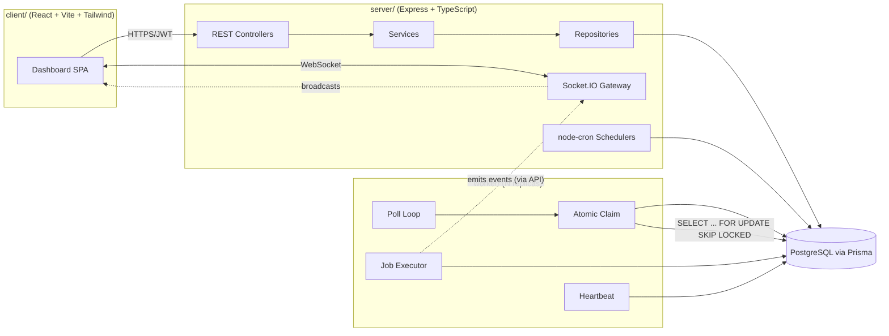
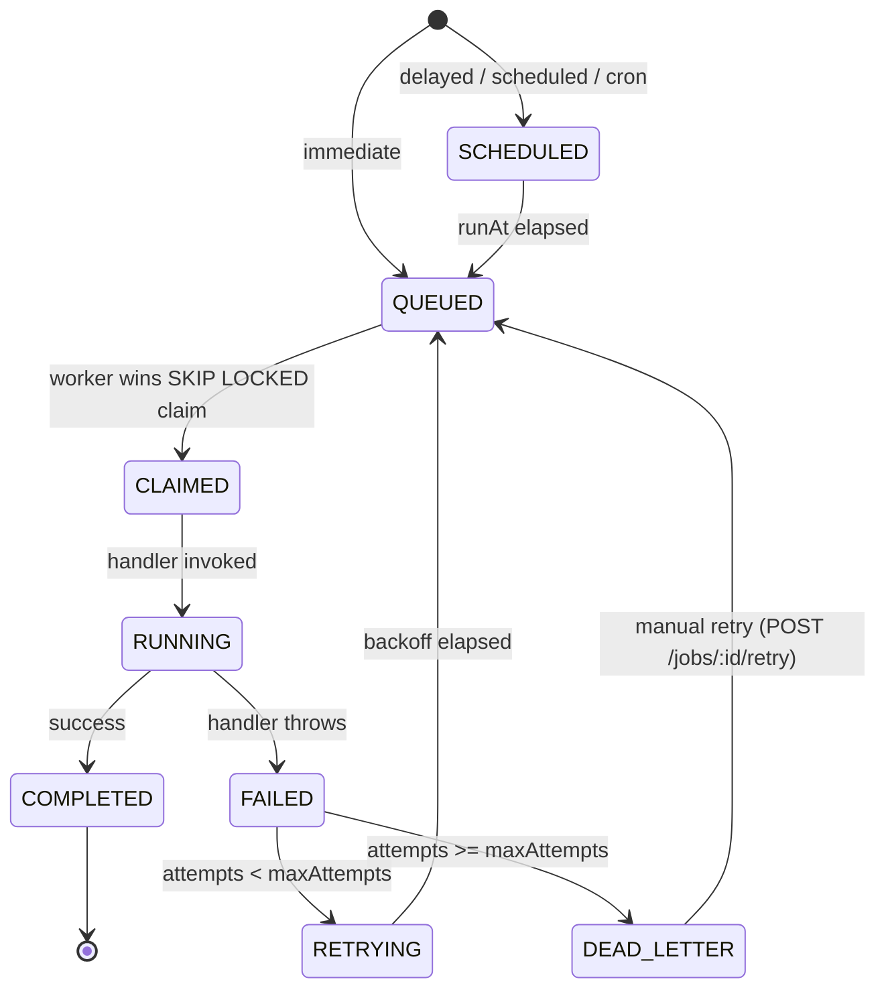
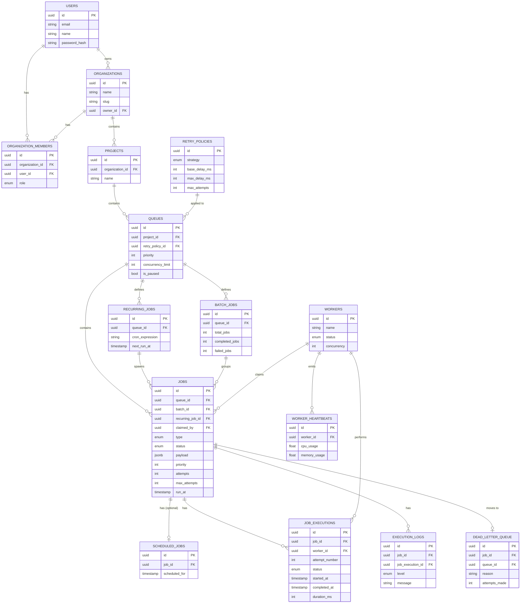

# Pulsar — Distributed Job Scheduling Platform

Pulsar is a full-stack, production-style distributed job scheduling platform
in the spirit of BullMQ / Sidekiq / Celery — built with **Postgres-backed
atomic job claiming**, a **horizontally scalable worker fleet**, **role-based
multi-tenant project management**, and a **realtime dashboard**.

> **Note on this workspace.** The interactive preview you're looking at is a
> fully wired **dashboard client** (`src/`) running against an in-browser
> simulation engine (`src/lib/engine.ts`) that faithfully reproduces the
> production backend's behaviour (atomic claiming, retries, DLQ, heartbeats,
> realtime events) so the whole system can be explored without provisioning
> infrastructure. The **complete, runnable backend** — Express API, worker
> service, Prisma schema, Docker Compose, tests — lives in `server/`,
> `worker/`, `database/`, and `docker/` exactly as it would in production, and
> the client is written against the same REST contract (see
> `docs/openapi.yaml`), so pointing `VITE_API_URL` at a running `server/`
> instance is a drop-in swap.

---

## 1. Feature summary

| Area | Highlights |
|---|---|
| Auth | Register / login / refresh, JWT access + refresh tokens, bcrypt hashing, RBAC (`ADMIN`, `DEVELOPER`, `VIEWER`) |
| Org & Projects | Multi-tenant organizations → projects → queues hierarchy, member invites, role assignment |
| Queues | Priority, concurrency limits, pause/resume, retry policy binding, live statistics |
| Jobs | Immediate, delayed, scheduled, recurring (cron), and batch jobs |
| Lifecycle | `QUEUED → SCHEDULED → CLAIMED → RUNNING → COMPLETED/FAILED → RETRYING → DEAD_LETTER`, every transition persisted |
| Workers | Independent Node.js process, DB polling, atomic claim, heartbeats, graceful shutdown, crash recovery |
| Retries | Fixed / linear / exponential backoff, max attempts, automatic DLQ hand-off |
| Realtime | Socket.IO broadcast of job/queue/worker events to the dashboard |
| Metrics | Throughput, success rate, retry rate, worker utilization, avg execution time |
| API | Versioned REST API, Zod validation, pagination/filtering/sorting, structured error envelope, OpenAPI spec |
| Testing | Vitest + Supertest integration tests: auth, queues, jobs, atomic claiming, retry math, DLQ |

---

## 2. Architecture



**Layering (server):** `routes → middleware (auth/RBAC/validation) → controllers
→ services (business logic) → repositories (Prisma access)`. This follows the
Repository Pattern and keeps each layer independently testable and swappable
(e.g., repositories could move to raw SQL or a different ORM without touching
services or controllers).

### Job lifecycle



---

## 3. Database design (ER diagram)

Full schema: [`database/schema.prisma`](database/schema.prisma). Every table
has a UUID primary key, `created_at`/`updated_at`, indexes on hot filter
columns, and cascade rules appropriate to ownership (deleting an organization
cascades to projects → queues → jobs; deleting a job cascades to its
executions/logs; deleting a worker nulls out `jobs.claimed_by`).



---

## 4. Atomic claiming — the core reliability guarantee

Every worker poll cycle runs this transaction (see
`worker/src/lib.ts::claimNextJob` and `server/src/repositories.ts::JobRepository.claimNextJob`):

```sql
BEGIN;
SELECT j.id
FROM jobs j
JOIN queues q ON q.id = j.queue_id
WHERE j.status = 'QUEUED'
  AND j.run_at <= now()
  AND q.is_paused = false
  AND q.id = ANY($assignedQueueIds)
  AND (SELECT count(*) FROM jobs j2
       WHERE j2.queue_id = q.id AND j2.status IN ('CLAIMED','RUNNING')) < q.concurrency_limit
ORDER BY j.priority DESC, j.run_at ASC
FOR UPDATE OF j SKIP LOCKED
LIMIT 1;

UPDATE jobs SET status = 'CLAIMED', claimed_by = $workerId, claimed_at = now()
WHERE id = $jobId;
COMMIT;
```

`FOR UPDATE SKIP LOCKED` lets N concurrent workers run this exact query in
parallel: Postgres locks the candidate row for the first transaction and
instantly skips it for everyone else instead of blocking, so **no two
workers can ever claim the same job** and throughput scales linearly with
worker count. This is verified by `server/tests/worker.test.ts`, which fires
8 concurrent claim attempts at a single job and asserts exactly one wins.

---

## 5. Retry strategies

Implemented in `shared/index.ts::computeRetryDelayMs` (used identically by
the worker and the server so behaviour never drifts):

| Strategy | Formula | Example (base=2s, attempt=3) |
|---|---|---|
| `FIXED` | `base` | 2s |
| `LINEAR` | `base * attempt` | 6s |
| `EXPONENTIAL` | `base * 2^(attempt-1)`, capped at `maxDelayMs` | 8s |

Once `attempts >= maxAttempts` the job transitions to `DEAD_LETTER` and a row
is written to `dead_letter_queue` with the failure reason and a payload
snapshot for later inspection/replay (`POST /jobs/:id/retry`).

---

## 6. Worker service

- Registers itself in `workers` on boot, claims work in a tight poll loop
  bounded by `WORKER_CONCURRENCY`.
- Sends a heartbeat (`cpu_usage`, `memory_usage`, `active_jobs`) every
  `HEARTBEAT_INTERVAL_MS`; the API's cron sweep (`server/src/scheduler.ts`)
  marks workers `OFFLINE` and **requeues their in-flight jobs** if a
  heartbeat is missed for 15s — this is the crash-recovery path.
- Handles `SIGTERM`/`SIGINT` by stopping new claims, waiting (bounded) for
  in-flight jobs to finish, marking itself `OFFLINE`, then exiting — safe for
  rolling deploys.
- Horizontally scalable: `docker compose up --scale worker=10`.

---

## 7. REST API

Base URL: `/api/v1`. Full reference: [`docs/openapi.yaml`](docs/openapi.yaml).

```
POST   /auth/register
POST   /auth/login
POST   /auth/refresh
GET    /auth/me

POST   /organizations
GET    /organizations
POST   /organizations/:organizationId/invite
GET    /organizations/:organizationId/members

POST   /projects
GET    /projects

POST   /retry-policies
GET    /retry-policies

POST   /queues
GET    /queues
PUT    /queues/:id
POST   /queues/:id/pause
POST   /queues/:id/resume

POST   /jobs
GET    /jobs            ?queueId&status&type&search&page&pageSize&sortBy&sortDir
GET    /jobs/:id
DELETE /jobs/:id
POST   /jobs/:id/retry

GET    /workers
GET    /logs             ?level&page&pageSize
GET    /dead-letter-queue
GET    /metrics
```

All error responses share one envelope:

```json
{ "success": false, "error": { "code": "VALIDATION_ERROR", "message": "...", "details": {} } }
```

---

## 8. Project structure

```
client/  (this Vite app lives at the repo root: src/, index.html, vite.config.ts)
server/  Express API — src/{config,utils,validators,middleware,repositories,services,controllers,routes,socket,scheduler}.ts
worker/  Standalone worker process — src/{index,lib}.ts
shared/  Types/constants shared by server, worker and client (retry math, socket event names)
database/ Prisma schema, seed script, ER diagram
docker/  docker-compose.yml + per-service Dockerfiles
docs/    OpenAPI spec (this README doubles as architecture/API docs)
```

---

## 9. Running the full stack locally

```bash
# 1. Start Postgres, run migrations + seed, boot the API, 3 workers, and the client
docker compose -f docker/docker-compose.yml up --build

# API:       http://localhost:4000/api/v1
# Dashboard: http://localhost:5173
```

Or run each piece natively:

```bash
# Database
createdb pulsar
cp .env.example server/.env && cp .env.example worker/.env

# API
cd server && npm install && npm run prisma:generate && npm run prisma:migrate && npm run seed && npm run dev

# Worker (run in one or more terminals to simulate a fleet)
cd worker && npm install && npm run dev

# Dashboard (this repo's root)
npm install && npm run dev
```

Demo accounts (seeded, password `password123`):
`admin@pulsar.dev` (ADMIN) · `dev@pulsar.dev` (DEVELOPER) · `viewer@pulsar.dev` (VIEWER)

### Tests

```bash
cd server && npm test   # Vitest + Supertest — auth, queues, jobs, atomic claim, retry math, DLQ
```

---

## 10. Bonus features implemented

- **Workflow dependencies (partial):** `BatchJob` groups N jobs and aggregates
  completion/failure counts, a foundation for DAG-style fan-out/fan-in.
- **Rate limiting:** queue `concurrencyLimit` enforces a hard cap on
  simultaneous executions per queue directly inside the atomic claim query.
- **Queue sharding:** workers can be assigned a subset of queue IDs
  (`claimNextJob(workerId, queueIds)`), enabling dedicated worker pools per
  queue/tenant.
- **Distributed locking:** `SELECT ... FOR UPDATE SKIP LOCKED` *is* the
  distributed lock — no external lock service required.
- **AI failure summary (placeholder):** `job.lastError` / `JobExecution.errorStack`
  are structured and ready to be piped into an LLM summarization endpoint
  (`POST /jobs/:id/summarize`, left as a stub for future integration).

---

## 11. Design decisions & trade-offs

- **Repository pattern** isolates Prisma so services/controllers are
  persistence-agnostic and unit-testable with in-memory fakes.
- **Shared package** guarantees the retry-delay formula and socket event
  names never drift between the API, the worker, and the dashboard.
- **Structured logging (Winston)** with JSON transport for `combined.log` /
  `error.log`, human-readable console output in development.
- **Optimistic realtime:** the API emits Socket.IO events immediately after a
  state mutation commits, so the dashboard never has to poll.
